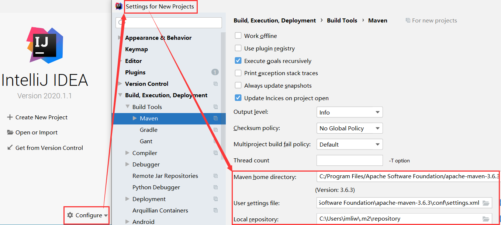
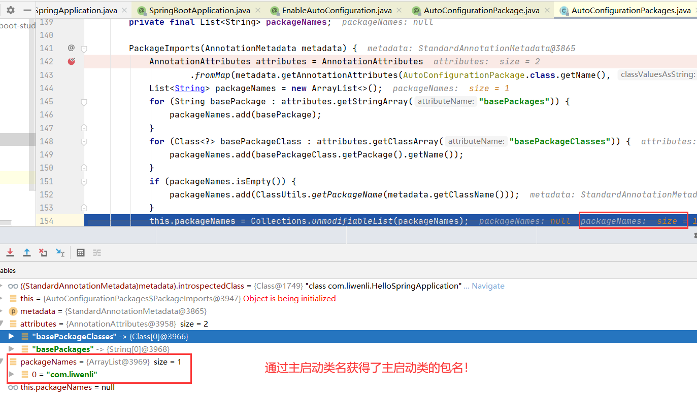
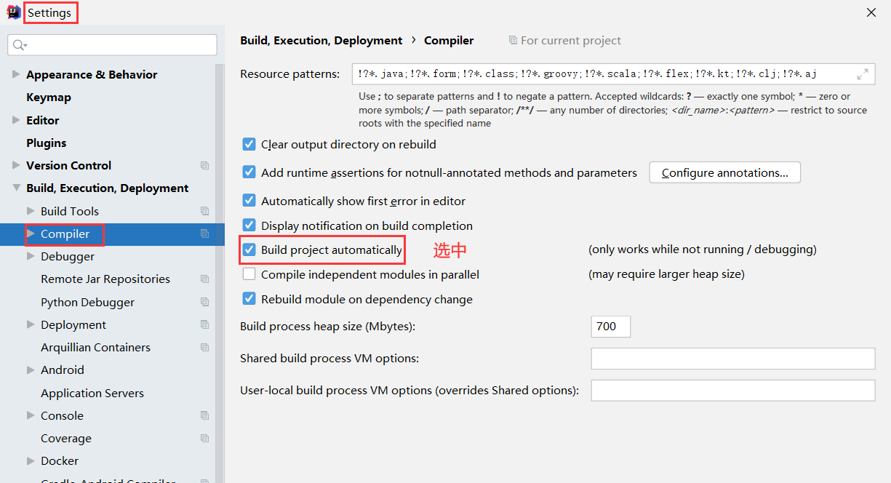
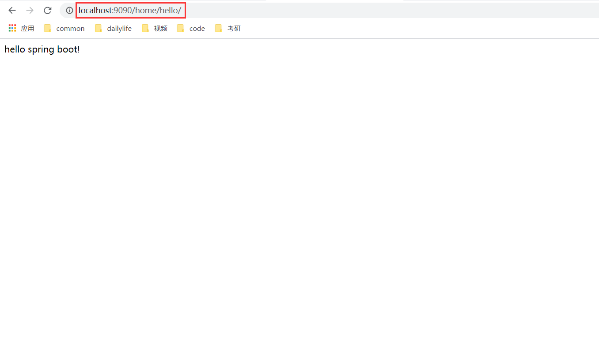
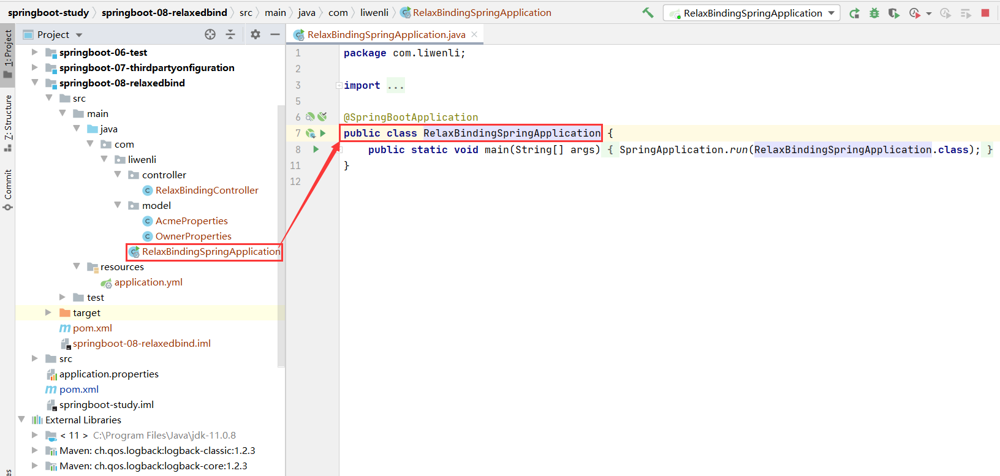
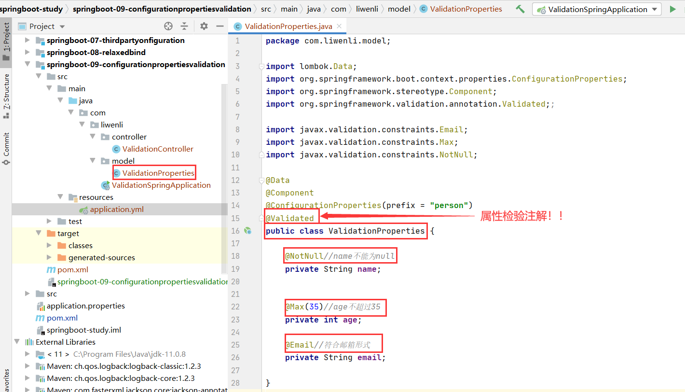
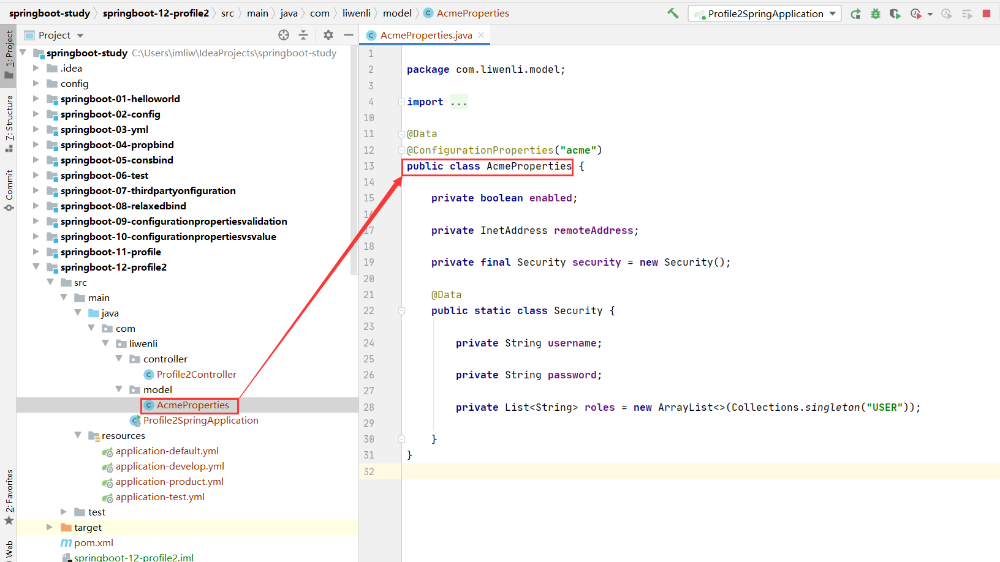
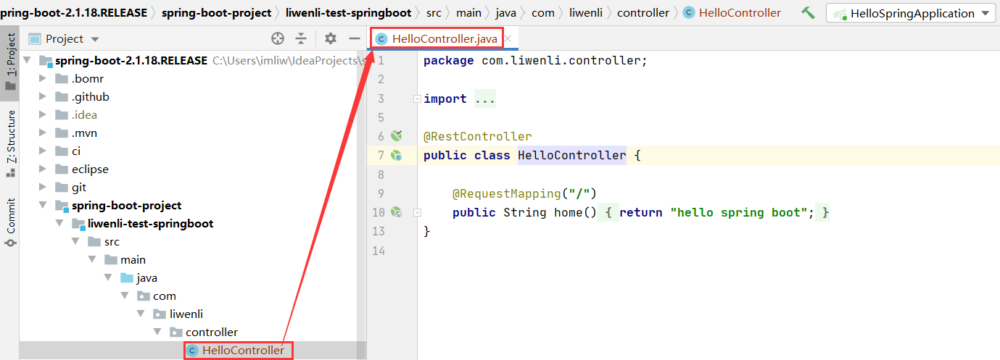
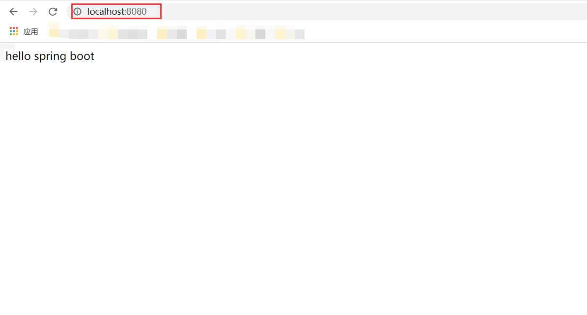

#springboot-notes
一二三四五六七八九十

⒈⒉⒊⒋⒌⒍⒎⒏⒐⒑

⑴⑵⑶⑷⑸⑹⑺⑻⑼⑽

①②③④⑤⑥⑦⑧⑨⑩
#概述


1. Springboot入门
2. Springboot属性绑定
3. Springboot热部署
4. Springboot源码导入
5. Springboot自动配置原理
6. Springboot数据源配置
7. Springboot自动配置mybatis
8. Springboot自动配置内嵌Tomcat
9. Springboot注册web组件
10. Springboot自动配置SpringMVC
11. Springboot模板引擎
12. Springboot项目练习
13. Springboot手写starter
14. Springboot整合redis缓存
15. Springboot消息组件整合
16. Springboot通过Docker虚拟化部署
17. Springboot通过Jenkins持续化构建
18. Springboot过渡到SpringCloud

# 一.Spring Boot 入门
[spring官网](https://spring.io/)

## 1. Spring Boot简介
###（1）什么是Spring Boot

> 简化Spring应用开发的一个框架。
>
> 整个Spring技术栈的一个大整合。
>
> JavaEE开发的一站式解决方案。
 
###（2）springboot的学习铺垫和要求

1.  对spring的IOC有深入的理解，springboot是基于spring的。
2.	深入掌握spring的注解开发。传统老程序员对注解认识偏少。
3.	最好有ssm项目的开发经验，因为springboot是整合了javaEE的技术。
4.	有较好的源码学习经验。
5.	有idea的使用经验
6.	在国内公司是一个主要的招聘要求。

###（3）springboot优点

1. 能够快速创建独立运行的Spring项目以及与主流框架集成。
2. 使用嵌入式的Servlet容器，应用无需打成WAR包
3. starters自动依赖与版本控制
4. 大量的自动配置，简化开发，也可修改默认值
5. 无需配置XML，无代码生成，开箱即用
6. 准生产环境的运行时应用监控
7. 与云计算(springcloud)的天然集成

###（4）springboot缺点
1. 将现有或传统的Spring Framework项目转换为Spring Boot应用程序是一个非常困难和耗时的过程。它仅适用于全新Spring项目。
2. 使用简单，学习成本高，精通难。

###（5）微服务
[微服务文档](https://martinfowler.com/articles/microservices.html#MicroservicesAndSoa)

1. 微服务：架构风格（服务微化）。
2. 单体应用：ALL IN ONE
3. 微服务：每一个功能元素最终都是一个可独立替换和独立升级的软件单元。
4. 微服务实例。


##2. 前期准备
###（1）环境准备
1. jdk：java 11.0.8 2020-07-14 LTS
2. maven3.x：Apache Maven 3.6.3
3. IntelliJ IDEA：IntellijJ IDEA 2020.1.1 (Ultimate Edition)
4. SpringBoot：SpringBoot 2.3.5.RELEASE

###（2）MAVEN设置
1. 配置阿里云镜像
 *  给maven的settings.xml配置文件的mirrors标签添加mirror子标签
```
<mirrors>
  
    <mirror>
      <id>aliyunmaven</id>
      <mirrorOf>*</mirrorOf>
      <name>阿里云公共仓库</name>
      <url>https://maven.aliyun.com/repository/public</url>
    </mirror>

  </mirrors>

```


2. maven jdk版本
 * 给maven的settings.xml配置文件的profiles标签添加profile子标签
```
<profiles>

<profile>
  <id>jdk-11</id>
  <activation>
    <activeByDefault>true</activeByDefault>
    <jdk>11</jdk>
  </activation>
  <properties>
    <maven.compiler.source>11</maven.compiler.source>
    <maven.compiler.target>11</maven.compiler.target>
    <maven.compiler.compilerVersion>11</maven.compiler.compilerVersion>
  </properties>
</profile>

</profiles>
```


###（3）idea设置

1. 指定jdk


2. 指定maven



##3. 第一个springboot工程
###（1）创建一个普通maven工程当作父工程
```
<?xml version="1.0" encoding="UTF-8"?>
<project xmlns="http://maven.apache.org/POM/4.0.0"
         xmlns:xsi="http://www.w3.org/2001/XMLSchema-instance"
         xsi:schemaLocation="http://maven.apache.org/POM/4.0.0 http://maven.apache.org/xsd/maven-4.0.0.xsd">
    <modelVersion>4.0.0</modelVersion>

    <groupId>com.liwenli</groupId>
    <artifactId>springboot-study</artifactId>
    <version>1.0-SNAPSHOT</version>


    <parent>
        <groupId>org.springframework.boot</groupId>
        <artifactId>spring-boot-starter-parent</artifactId>
        <version>2.3.5.RELEASE</version>
    </parent>

    <dependencies>

        <dependency>
            <groupId>org.springframework.boot</groupId>
            <artifactId>spring-boot-starter-web</artifactId>
        </dependency>

    </dependencies>

</project>
```


###（2）创建maven子工程(module)
```
<?xml version="1.0" encoding="UTF-8"?>
<project xmlns="http://maven.apache.org/POM/4.0.0"
         xmlns:xsi="http://www.w3.org/2001/XMLSchema-instance"
         xsi:schemaLocation="http://maven.apache.org/POM/4.0.0 http://maven.apache.org/xsd/maven-4.0.0.xsd">
    <parent>
        <artifactId>springboot-study</artifactId>
        <groupId>com.liwenli</groupId>
        <version>1.0-SNAPSHOT</version>
    </parent>
    <modelVersion>4.0.0</modelVersion>

    <artifactId>springboot-01-helloworld</artifactId>


</project>
```


###（3）HelloController.java
```
package com.liwenli.controller;

import org.springframework.web.bind.annotation.RequestMapping;
import org.springframework.web.bind.annotation.RestController;

@RestController
public class HelloController {

    @RequestMapping("/")
    public String hello() {
        return "hello spring boot";
    }
}

```


###（4）HelloSpringApplication.java
```
package com.liwenli;

import org.springframework.boot.SpringApplication;
import org.springframework.boot.autoconfigure.SpringBootApplication;

@SpringBootApplication
public class HelloSpringApplication {
    public static void main(String[] args) {
        SpringApplication.run(HelloSpringApplication.class, args);
    }
}

```


###（5）运行项目

###（6）网页访问


###（7）创建一个可执行的jar
1.在父工程的pom.xml中加上一个spring-boot-maven-plugin插件
```
<build>
    <plugins>
        <plugin>
            <groupId>org.springframework.boot</groupId>
            <artifactId>spring-boot-maven-plugin</artifactId>
        </plugin>
    </plugins>
</build>
```


2.由于当前是父子包含的工程关系，因此我们需要在我们的父工程目录下指定要打包的子工程并进行打包，
而不能在terminal中直接使用mvn package命令，应该使用mvn -f springboot-01-helloworld clean package(clean 清理，package打包)
* 当然也可以通过切换到子工程目录而直接使用mvn package命令！
```
$ mvn -f springboot-01-helloworld clean package
```


3.打包后会在对应的工程的target目录生成一个可执行的jar文件


4.运行jar文件(运行之前需要将上次运行springboot程序关闭，要不然会出现端口冲突而启动失败)
* 也可以切换到jar目录直接使用$ java -jar springboot-01-helloworld-1.0-SNAPSHOT.jar

```
$ java -jar springboot-01-helloworld/target/springboot-01-helloworld-1.0-SNAPSHOT.jar
```


5.运行结果

6.ctrl+c退出

##4.分析第一个springboot工程
###（1）疑问
1. starter是什么？我如何去使用这些starter？
2. Tomcat的内嵌是如何完成
3. 使用了web对应的starter，springmvc是如何自动装配？
4. 我们如何来配置我们自定义的相关内容。

##5.springboot的系统构建分析
###（1）spring boot工程不需要我们手动管理依赖版本


1.父工程springboot-study的pom.xml文件的父工程是spring-boot-starter-parent
```
<!--    spring-boot-starter-parent管理了spring boot的所有starter-->
    <parent>
        <groupId>org.springframework.boot</groupId>
        <artifactId>spring-boot-starter-parent</artifactId>
        <version>2.3.5.RELEASE</version>
    </parent>

```


2.spring-boot-starter-parent工程pom.xml文件的父工程是spring-boot-dependencies
```
 <parent>
    <groupId>org.springframework.boot</groupId>
    <artifactId>spring-boot-dependencies</artifactId>
    <version>2.3.5.RELEASE</version>
  </parent>
```


3.spring-boot-dependencies工程的pom.xml下是当前springboot版本的所有依赖以及依赖的版本的管理。


###（2）starter
1.spring boot为我们提供了很多的starter
* spring-boot-starter-*


2.自定义starter
* thirdpartyproject-spring-boot-starter

##6.主启动类的默认扫描器
1.目录的经典布局
```
com
 +- example
     +- myapplication//basepackage,默认扫描这个包下面的所有文件及子目录！
         +- Application.java//主启动类
         |
         +- customer
         |   +- Customer.java
         |   +- CustomerController.java
         |   +- CustomerService.java
         |   +- CustomerRepository.java
         |
         +- order
             +- Order.java
             +- OrderController.java
             +- OrderService.java
             +- OrderRepository.java
```

2.springboot的主启动类所在的package就是扫描器的basepackage ，扫描器默认扫描basepackage下面的所有文件和子目录。
或者说扫描器默认扫描springbootapplication主启动类的同级目录和同级目录的子目录。


##7.主启动类的默认扫描器的源码解析
1.进入HelloSpringApplication.java


2.进入@SpringBootApplication注解
* @AutoConfigurationPackage负责basepackge的注册


3.进入@EnableAutoConfiguration注解
* @AutoConfigurationPackage内部使用@Import来做bean的定义的注册

4.进入@AutoConfigurationPackage注解
让我们进入AutoConfigurationPackages.Registrar，
通过register的调用来注册basepackage的bean定义

5.进入Registrar


6.进入PackageImports(metadata)

进入到PackageImports，获得basepackge设置给packageNames





7.进入Register
回到上一层进入到register，创建bean的定义并且把packageNames设置给bean定义
然后把bean定义的做注册。


8.总结一下

通过反射获取主启动类（HelloSpringApplication.java）所在的包名（com.liwenli），之后将主启动类所在的包（com.liwenli）进行扫描注册，
也就是<context:component-scan base-package="org.example"/>，
最后主启动类所在的包（com.liwenli）下面的所有的Java类以及其子目录下面的所有Java类都会被注册到spring容器中，从而实现了spring容器的注册！


9.IDEA的两个小技巧


##二.热部署
###（1）热部署背景
1. 在实际开发过程中，每次修改代码就得将项目重启，重新部署，对于一些大型应用来说，重启时间需要花费大量的时间成本。
2. 在 Java 开发领域，热部署一直是一个难以解决的问题，目前的 Java 虚拟机只能实现方法体的修改热部署，对于整个类的结构修改，仍然需要重启虚拟机，对类重新加载才能完成更新操作。

###（2）热部署的原理
深层原理是使用了两个ClassLoader，一个Classloader加载那些不会改变的类（第三方Jar包），另一个ClassLoader加载会更改的类，称为restart ClassLoader,这样在有代码更改的时候，原来的restart ClassLoader 被丢弃，重新创建一个restart ClassLoader，由于需要加载的类相比较少，所以实现了较快的重启时间。

###（3）devtools工具包
1. devtools会监听classpath下的文件变动，并且会立即重启应用（发生在保存时机），
java类文件热部署（类文件修改后不会立即生效，需要切换到浏览器的时候才会生效！），实现对属性文件的热部署。

2. devtools可以实现页面热部署（页面修改后会立即生效，这个可以直接在application.properties文件中配置spring.thymeleaf.cache=false来实现，后面讲到）。

###（4）热部署实现

1.在pom.xml(父工程和子工程都行)中导入devtools工具包的坐标
```
<dependencies>
    <dependency>
        <groupId>org.springframework.boot</groupId>
        <artifactId>spring-boot-devtools</artifactId>
        <optional>true</optional>
    </dependency>
</dependencies>
```


2.设置IDEA

* 选中Build project automatically



* CTRL + SHIFT + ALT + /


3.结果展示


###（5）热部署的排除
默认情况下，/META-INF/maven，/META-INF/resources，/resources，/static，/templates，/public这些文件夹下的文件修改不会使应用重启，但是会重新加载（devtools内嵌了一个LiveReload server，当资源发生改变时，浏览器刷新）。

1.	我们在resources/static目录下创建liwenli.js文件每次发生修改后的并不重启，而是采用livereload的方式。
2.	同时我们可以根据自己的意愿来设置想要排除的资源
```
spring.devtools.restart.exclude=static/**,public/**
```


#三.config
##（1）配置文件位置
* springboot 启动会扫描以下位置的application.properties或者application.yml文件作为Spring boot的默认配置文件
1. –file:./config/
2. –file:./ 项目的根路径，如果当前的项目有父工程，配置文件要放在父工程的根路径，也就是项目名下面并和父工程的pom.xml同级。
3. –classpath:/config/
4. –classpath:/
5. 优先级由高到底，高优先级的配置会覆盖低优先级的配置。


6. SpringBoot会从这四个位置全部加载主配置文件，互补配置。

##（2）自命名配置文件

1.如果你不想让application.properties成你的默认配置文件，那么你可以通过spring.config.name来改变你的配置文件名字 ，我们可以设置IDEA来改变spring boot项目的默认配置文件名字。




2.如果我们的配置文件名字不叫application.properties或者application.yml，可以通过以下参数来指定配置文件的名字，myproject是配置文件名
```
$ java -jar myproject.jar --spring.config.name=myproject
```
```
$ java -jar springboot-02-config/target/springboot-02-config-1.0-SNAPSHOT.jar --spring.config.name=myproject
```


#四. yml
###（1）yml的简介

1. yml是YAML（YAML Ain't Markup Language）语言的文件，以数据为中心，比properties、xml等更适合做配置文件
2. yml和xml相比，少了一些结构化的代码，使数据更直接，一目了然。
3. 相比properties文件更简洁，更具有层次性。

###（2）yml语法（语法和python非常相似）
以空格的缩进程度来控制层级关系。空格的个数并不重要，只要左边空格对齐则视为同一个层级。
且大小写敏感。支持字面值，对象，数组三种数据结构，也支持复合结构。
1. 字面值：字符串，布尔类型，数值，日期。字符串默认不加引号，单引号会转义特殊字符。日期格式支持yyyy/MM/dd HH:mm:ss
2. 对象：由键值对组成，形如 key:(空格)value 的数据组成。冒号后面的空格是必须要有的，如果没有空格那么这个整体就是一个键，而没有值。每组键值对占用一行，且缩进的程度要一致，也可以使用行内写法：{k1: v1, ....kn: vn}
3. 数组：由形如 -(空格)value 的数据组成。短横线后面的空格是必须要有的，每组数据占用一行，且缩进的程度要一致，也可以使用行内写法： [1,2,...n]
4. 复合结构：上面三种数据结构任意组合

###（3）yaml运用
创建一个Spring Boot 的全局配置文件application.yml，配置属性参数。
主要有字符串，带特殊字符的字符串，布尔类型，数值，集合，行内集合，行内对象，集合对象这几种常用的数据格式。

####application.yml
```
#平时我们一般都使用application.yml文件作为配置文件，而不是application.properties文件
yml:
  str: 字符串可以不加引号
  specialStr: "双引号直接输出\n特殊字符"
  specialStr2: '单引号可以转义\n特殊字符'
  flag: false
  num: 666
  dnum: 88.88
  birth: 2020/11/10 11:21:23
  list:
    - one
    - two
    - three
  set: [1,2,2,3]
  map: {k1: v1, k2: v2}
  user:
     name: liwenli
     age: 21
     sex: male
     addr: 湖南省郴州市
```


####YmlModel.java
```
package com.liwenli.model;
import lombok.Data;
import org.apache.tomcat.jni.BIOCallback;
import org.springframework.boot.context.properties.ConfigurationProperties;
import org.springframework.stereotype.Component;
import java.util.*;
//首先需要将这个类放入到spring ioc容器中进行管理需要用到@Component
@Component
/*其次需要加上一个spring boot中用来将yml配置文件中的属性绑定到类里面的属性进行注入用的注解@ConfigurationProperties
@ConfigurationProperties是有属性的，这个属性是prefix，属性的值就是当前类中属性的上一个层级，
而YamlModel.java中的属性的上一个层级对应于application.yml中的属性的上一个层级是yaml，所以prefix=="yaml"
当spring 容器把YamlModel这个bean做初始化的时候，spring容器发现YamlModel这个bean有@ConfigurationProperties这个注解，
于是spring容器就会到这个@ConfigurationProperties中找这个前缀prefix="yaml"，再进入application.yml中找到这个前缀yaml。
spring容器会将application.yml里面的yaml前缀下面的属性的值和java bean实体类（YamlModel.java）中的属性的值作匹配，
并通过java实体类中的getter,setter方法将java bean实体类（YamlModel.java）中的属性值设置成application.yml中的前缀yaml中的属性对应的value值。
 */
@Data
@ConfigurationProperties(prefix = "yml")
public class YmlModel {
    private String str;
    private int num;
    private double dnum;
    private Date birth;
    private String specialStr;
    private String specialStr2;
    private boolean flag;
    private List<String> list ;
    private Set<Integer> set;
    private Map<String, String> map;
    private User user;
}

```


####User.java
```
package com.liwenli.model;

import lombok.Data;
import org.springframework.beans.factory.annotation.Autowired;
import org.springframework.stereotype.Component;

@Data
@Component//将User注入到spring容器中
public class User {
    private String name;
    private int age;
    private String addr;
    private String sex;
}

```


####YmlController.java
```
package com.liwenli.controller;

import com.liwenli.model.YmlModel;
import org.springframework.beans.factory.annotation.Autowired;
import org.springframework.web.bind.annotation.RequestMapping;
import org.springframework.web.bind.annotation.RestController;

@RestController
public class YmlController {

    @Autowired  //注入到spring中
    private YmlModel ymlModel;
    @RequestMapping("/yml")
    public YmlModel yml() {
        System.out.println(ymlModel);//在控制台中显示
        return ymlModel;//返回到视图
    }

}

```


####结果展示


###（4）yml的特点
1. 大小写敏感
2. 使用缩进表示层级关系
3. 冒号后面的缩进不允许使用tab，只允许空格
4. 缩进的空格数不重要，只要相同层级的元素左对齐即可
5. '#'表示注释
6. 键和值之间的空格不能够省略，省略了空格就是一个键了，没有值了

#五.javabean properties binding
##（1）设置application.yml提示
1.为了让当前的实体类能在配置文件中有对应的提示，我们需要在父工程pom.xml文件引入如下的依赖
```
<dependency>
    <groupId>org.springframework.boot</groupId>
    <artifactId>spring-boot-configuration-processor</artifactId>
    <optional>true</optional>
</dependency>
```


2.加完依赖后通过Ctrl+F9来使之生效。（如果还不行就重启下idea）


3.实体类AcmeProperties.java
```
package com.liwenli.model;

import org.springframework.boot.context.properties.ConfigurationProperties;
import org.springframework.stereotype.Component;
import java.net.InetAddress;
import java.util.ArrayList;
import java.util.Collections;
import java.util.List;

@Component
@ConfigurationProperties("acme")
public class AcmeProperties {

    private boolean enabled;

    private InetAddress remoteAddress;

    private final Security security = new Security();

    public boolean isEnabled() {
        return enabled;
    }
    public void setEnabled(boolean enabled) {
        this.enabled = enabled;
    }
    public InetAddress getRemoteAddress() {
        return remoteAddress;
    }
    public void setRemoteAddress(InetAddress remoteAddress) {
        this.remoteAddress = remoteAddress;
    }
    public Security getSecurity() {
        return security;
    }
    public static class Security {

        private String username;

        private String password;

        private List<String> roles = new ArrayList<>(Collections.singleton("USER"));

        public String getUsername() {
            return username;
        }

        public void setUsername(String username) {
            this.username = username;
        }

        public String getPassword() {
            return password;
        }

        public void setPassword(String password) {
            this.password = password;
        }

        public List<String> getRoles() {
            return roles;
        }

        public void setRoles(List<String> roles) {
            this.roles = roles;
        }

        @Override
        public String toString() {
            return "Security{" +
                    "username='" + username + '\'' +
                    ", password='" + password + '\'' +
                    ", roles=" + roles +
                    '}';
        }
    }

    @Override
    public String toString() {
        return "AcmeProperties{" +
                "enabled=" + enabled +
                ", remoteAddress=" + remoteAddress +
                ", security=" + security +
                '}';
    }
}

```


4.application.yml
```
acme:
  enabled: true
  remote-address: 192.168.0.108
#  这里application.yml中的remote-address对应于AcmeProperties类属性中的    private InetAddress remoteAddress;
#  驼峰命名到中划线命名是用到了@ConfigurationProperties("acme")的松散耦合
  security:
    username: liwenli
    password: liwenli
    roles:
      - liwenli
      - wangshuwei
```


5.PropbindController.java
```
package com.liwenli.controller;

import com.liwenli.model.AcmeProperties;
import org.springframework.beans.factory.annotation.Autowired;
import org.springframework.web.bind.annotation.RequestMapping;
import org.springframework.web.bind.annotation.RestController;

@RestController
public class PropbindController {

    @Autowired//对AcmeProperties属性进行自动注入
    private AcmeProperties acmeProperties;

    @RequestMapping("/propbind")
    public AcmeProperties propbind() {
        System.out.println(acmeProperties);
        return acmeProperties;
//        System.out.println(acmeProperties);//不能放在return语句的后面了，return表示函数返回结束了

    }
}

```


6.springboot应用的主启动类PropbindSpringApplication.java
```
package com.liwenli;

import org.springframework.boot.SpringApplication;
import org.springframework.boot.autoconfigure.SpringBootApplication;

@SpringBootApplication
public class PropbindSpringApplication {
    public static void main(String[] args) {
        SpringApplication.run(PropbindSpringApplication.class, args);

    }
}

```


7.结果展示


##（2）使用lombok插件
1.在属性绑定的方式里，我们是通过set方法来完成的，我们可以借助lombok来给我们带来方便。

2.下载lombok插件


3.在父工程中引入Lombok的依赖
```
<dependency>
    <groupId>org.projectlombok</groupId>
    <artifactId>lombok</artifactId>
    <version>1.18.16</version>
</dependency>
```


3.修改AcmeProperties.java，加上@Data注解，删除掉getter，setter，toString等方法！
```
package com.liwenli.model;

import lombok.Data;
import org.springframework.boot.context.properties.ConfigurationProperties;
import org.springframework.stereotype.Component;
import java.net.InetAddress;
import java.util.ArrayList;
import java.util.Collections;
import java.util.List;

@Data
@Component
@ConfigurationProperties("acme")
public class AcmeProperties {

    private boolean enabled;

    private InetAddress remoteAddress;

    private final Security security = new Security();

    @Data
    public static class Security {

        private String username;

        private String password;

        private List<String> roles = new ArrayList<>(Collections.singleton("USER"));

    }
}

```


4.结果展示


##（3）使用@EnableConfigurationProperties(AcmeProperties.class)
1.AcmeProperties.java，不再使用@Component
```
//使用getter,setter,toString方法
/*
package com.liwenli.model;

import org.springframework.boot.context.properties.ConfigurationProperties;
import org.springframework.stereotype.Component;
import java.net.InetAddress;
import java.util.ArrayList;
import java.util.Collections;
import java.util.List;

@Component
@ConfigurationProperties("acme")
public class AcmeProperties {

    private boolean enabled;

    private InetAddress remoteAddress;

    private final Security security = new Security();

    public boolean isEnabled() {
        return enabled;
    }
    public void setEnabled(boolean enabled) {
        this.enabled = enabled;
    }
    public InetAddress getRemoteAddress() {
        return remoteAddress;
    }
    public void setRemoteAddress(InetAddress remoteAddress) {
        this.remoteAddress = remoteAddress;
    }
    public Security getSecurity() {
        return security;
    }
    public static class Security {

        private String username;

        private String password;

        private List<String> roles = new ArrayList<>(Collections.singleton("USER"));

        public String getUsername() {
            return username;
        }

        public void setUsername(String username) {
            this.username = username;
        }

        public String getPassword() {
            return password;
        }

        public void setPassword(String password) {
            this.password = password;
        }

        public List<String> getRoles() {
            return roles;
        }

        public void setRoles(List<String> roles) {
            this.roles = roles;
        }

        @Override
        public String toString() {
            return "Security{" +
                    "username='" + username + '\'' +
                    ", password='" + password + '\'' +
                    ", roles=" + roles +
                    '}';
        }
    }

    @Override
    public String toString() {
        return "AcmeProperties{" +
                "enabled=" + enabled +
                ", remoteAddress=" + remoteAddress +
                ", security=" + security +
                '}';
    }
}

 */


//使用lombok插件
package com.liwenli.model;

import lombok.Data;
import org.springframework.boot.context.properties.ConfigurationProperties;
import org.springframework.stereotype.Component;
import java.net.InetAddress;
import java.util.ArrayList;
import java.util.Collections;
import java.util.List;

@Data
//@Component//可以在PropbindController.java中使用@EnableConfigurationProperties(AcmeProperties.class)来将AcmeProperties.java注入spring IOC容器
@ConfigurationProperties("acme")
public class AcmeProperties {

    private boolean enabled;

    private InetAddress remoteAddress;

    private final Security security = new Security();

    @Data
    public static class Security {

        private String username;

        private String password;

        private List<String> roles = new ArrayList<>(Collections.singleton("USER"));

    }
}

```


2.PropbindController.java，使用@EnableConfigurationProperties(AcmeProperties.class)，注入AcmeProperties.java
```
package com.liwenli.controller;

import com.liwenli.model.AcmeProperties;
import org.springframework.beans.factory.annotation.Autowired;
import org.springframework.boot.context.properties.EnableConfigurationProperties;
import org.springframework.web.bind.annotation.RequestMapping;
import org.springframework.web.bind.annotation.RestController;

@EnableConfigurationProperties(AcmeProperties.class)
@RestController
public class PropbindController {

    @Autowired//对AcmeProperties属性进行自动注入
    private AcmeProperties acmeProperties;

    @RequestMapping("/propbind")
    public AcmeProperties propbind() {
        System.out.println(acmeProperties);
        return acmeProperties;
//        System.out.println(acmeProperties);//不能放在return语句的后面了，return表示函数返回结束了
    }
}
```


3.PropbindSpringApplication.java。
```
package com.liwenli;

import org.springframework.boot.SpringApplication;
import org.springframework.boot.autoconfigure.SpringBootApplication;

@SpringBootApplication
public class PropbindSpringApplication {
    public static void main(String[] args) {
        SpringApplication.run(PropbindSpringApplication.class, args);

    }
}
```


4.结果展示


#六.constructor bindbing

1.AcmeProperties.java
```
package com.liwenli.model;

import org.springframework.boot.context.properties.ConfigurationProperties;
import org.springframework.boot.context.properties.ConstructorBinding;
import java.net.InetAddress;
import java.util.List;


//@Component//不需要使用@Component注解
@ConfigurationProperties("acme")
@ConstructorBinding//构造器绑定的注解
public class AcmeProperties {

    private boolean enabled;

    private InetAddress remoteAddress;


    private Security security;//这里不需要给初始值了 //private final Security security = new Security();//这里不需要给初始值了

    public boolean isEnabled() {
        return enabled;
    }

    public InetAddress getRemoteAddress() {
        return remoteAddress;
    }

    public Security getSecurity() {
        return security;
    }

    public AcmeProperties(boolean enabled, InetAddress remoteAddress, Security security) {
        this.enabled = enabled;
        this.remoteAddress = remoteAddress;
        this.security = security;
    }

    public static class Security {


        private String username;

        private String password;

        private List<String> roles;

        public String getUsername() {
            return username;
        }

        public String getPassword() {
            return password;
        }

        public List<String> getRoles() {
            return roles;
        }

        public Security(String username, String password, List<String> roles) {
            this.username = username;
            this.password = password;
            this.roles = roles;
        }
    }
}
```


2.ConsbindController.java
```
package com.liwenli.controller;

import com.liwenli.model.AcmeProperties;
import org.springframework.beans.factory.annotation.Autowired;
import org.springframework.boot.context.properties.EnableConfigurationProperties;
import org.springframework.web.bind.annotation.RequestMapping;
import org.springframework.web.bind.annotation.RestController;

@EnableConfigurationProperties(AcmeProperties.class)//需要导入class包
/*
要使用构造函数绑定，必须使用@EnableConfigurationProperties或配置属性扫描启用类。
不能对由常规Spring机制创建的Bean使用构造函数绑定（例如@Component Bean、通过@Bean方法创建的Bean或使用@Import加载的Bean）

在springboot-04-propbind属性绑定的案例中我们同样也可以使用@EnableConfigurationProperties，此时不需要提供@Component
如果一个配置类只配置@ConfigurationProperties注解，而没有使用@Component，那么在IOC容器中是获取不到properties 配置文件转化的bean。
说白了 @EnableConfigurationProperties 相当于把使用 @ConfigurationProperties 的类进行了启用注入。
 */
@RestController
public class ConsbindController {

    @Autowired//对AcmeProperties属性进行自动注入
    private AcmeProperties acmeProperties;

    @RequestMapping("/consbind")
    public AcmeProperties consbind() {
        System.out.println(acmeProperties);
        return acmeProperties;
//        System.out.println(acmeProperties);//不能放在return语句的后面了，return表示函数返回结束了
    }
}

```


3.主启动类ConsbindSpringApplication.java
```
package com.liwenli;

import org.springframework.boot.SpringApplication;
import org.springframework.boot.autoconfigure.SpringBootApplication;

@SpringBootApplication
public class ConsbindSpringApplication {
    public static void main(String[] args) {
        SpringApplication.run(ConsbindSpringApplication.class, args);

    }
}

```


4.结果展示


#七.@ConfigruationProperties在配置类中的应用
##（1）springboot提供的自动配置类


##（2）个人的一些想法
我们使用的很多第三方框架都是由springboot团队提供的整合启动类，
开发第三方框架的团队不会主动的以springboot的相关规范提供一些启动类，
这样会导致第三方框架更新的时候springboot团队的压力可能会增大，
甚至不能很好的兼容新的第三方框架，
我们假设框架的公司愿意以springboot 为核心，主动开发以spring boot为核心的主启动类，
那么spring boot会更加的适应第三方框架。

#七.spring boot 2.2.1新特性
1.因为我们不需要使用config.xml来作为配置文件了，因此我们需要用java类来设置配置类，
在之前的springboot版本中我们都是使用@Configuration来将java类作为配置类，
从SpringBoot2.2.1.RELEASE版本开始，
只要我们在一个配置类的扫描范围之内（spring boot主启动类提供了@Configuration,只要配置类在spring boot主启动类的扫描范围之内，我们就不需要在主启动类扫描范围之内的其他配置类内使用@Configuration注解了，因为它已经具备了@Configuration的功能了）
我们就不需要再在该java类中使用@Configuration来表示一个配置类了，

2.TestModel.java
```
package com.liwenli.model;

public class TestModel {
}

```


3.TestController.java
```
package com.liwenli.controller;

import com.liwenli.model.TestModel;
import org.springframework.beans.factory.annotation.Autowired;
import org.springframework.context.annotation.Bean;
import org.springframework.context.annotation.Configuration;
import org.springframework.web.bind.annotation.RequestMapping;
import org.springframework.web.bind.annotation.RestController;

//@Configuration//因为主启动类已经有@Configuration注解，因此被主启动类扫描的类都不需要使用@Configuration就能有@Configuration的功能了！
@RestController("/test")
public class TestController {

    @Bean
    public TestModel getTestModel() {
        return new TestModel();
    }

    @Autowired
    private TestModel testModel;

    @RequestMapping("/test")
    public String test() {

        System.out.println(testModel);
        return "hello springboot!";
    }


}

```


4.TestSpringApplication.java

```
package com.liwenli;

import org.springframework.boot.SpringApplication;
import org.springframework.boot.autoconfigure.SpringBootApplication;

@SpringBootApplication
public class TestSpringApplication {
    public static void main(String[] args) {
        SpringApplication.run(TestSpringApplication.class, args);
    }
}
```


5.结果展示


#八.Third-Part Configuration

1.AcmeProperties.java（@ConfigurationProperties("acme")一定要记得注释掉，因为我们的目的是通过第三方组件注入）
```

package com.liwenli.model;

import lombok.Data;
import org.springframework.boot.context.properties.ConfigurationProperties;

import java.net.InetAddress;
import java.util.ArrayList;
import java.util.Collections;
import java.util.List;

@Data
//@Component//可以在PropbindController.java中使用@EnableConfigurationProperties(AcmeProperties.class)来将AcmeProperties.java注入spring IOC容器
//@ConfigurationProperties("acme")//这里的属性绑定一定要注释掉，要不然和第三方绑定的bean(MyService.java)中的@ConfigurationProperties("acme")会重复的绑定AcmeProperties.java的属性的值
public class AcmeProperties {

    private boolean enabled;

    private InetAddress remoteAddress;

    private final Security security = new Security();

    @Data
    public static class Security {

        private String username;

        private String password;

        private List<String> roles = new ArrayList<>(Collections.singleton("USER"));

    }
}

```


2.MyService.java
```
package com.liwenli.service;

import com.liwenli.model.AcmeProperties;
import org.springframework.boot.context.properties.ConfigurationProperties;
import org.springframework.context.annotation.Bean;
import org.springframework.stereotype.Service;

@Service//保证这个类在主启动类的扫描范围之内即可，不需要再加@Configuration这个注解表示配置类了
public class MyService {

    @Bean
    @ConfigurationProperties("acme")//这个MyService.java就是充当第三方组件，用来注入AcmeProperties.java的属性！！
    public AcmeProperties getAcmeProperties() {
        return new AcmeProperties();
    }
}

```


3.ThirdPartConfigurationController.java
```
package com.liwenli.controller;

import com.liwenli.model.AcmeProperties;
import org.springframework.beans.factory.annotation.Autowired;
import org.springframework.web.bind.annotation.RequestMapping;
import org.springframework.web.bind.annotation.RestController;

@RestController//保证这个类在主启动类的扫描范围之内即可，不需要再加@Configuration这个注解表示配置类了
public class ThirdPartConfigurationController {

    @Autowired//对AcmeProperties进行注入
    private AcmeProperties acmeProperties;

    @RequestMapping("/thirdpartconfiguration")
    public String thirdPartConfiguration() {
        System.out.println(acmeProperties);
        return "third-part configuration";
    }


}

```

4.spring boot主启动类ThirdPartConfigurationSpringApplication.java
```
package com.liwenli;

import org.springframework.boot.SpringApplication;
import org.springframework.boot.autoconfigure.SpringBootApplication;

@SpringBootApplication
public class ThirdPartConfigurationSpringApplication {
    public static void main(String[] args) {
        SpringApplication.run(ThirdPartConfigurationSpringApplication.class);
    }
}
```


5.结果展示


#九.松散绑定
##（1）简介
Spring Boot使用一些宽松的规则将环境属性绑定到@ConfigurationProperties bean，因此环境属性名和bean属性名之间不需要完全匹配，即可以使用小驼峰，下划线，大写下划线，中划线等形式。
```
属性文件中配置	说明
acme.my-project.person.first-name	羊肉串模式case, 推荐使用
acme.myProject.person.firstName	        标准驼峰模式
acme.my_project.person.first_name	下划线模式
ACME_MYPROJECT_PERSON_FIRSTNAME	        大写下划线，如果使用系统环境时候推荐使用


```

##（2）演示


1.model AcmeProperties.java

```
package com.liwenli.model;

import lombok.Data;
import org.springframework.boot.context.properties.ConfigurationProperties;
import org.springframework.stereotype.Component;

import java.net.InetAddress;
import java.util.ArrayList;
import java.util.Collections;
import java.util.List;

@Data
@Component
//可以在PropbindController.java中使用@EnableConfigurationProperties(AcmeProperties.class)来将AcmeProperties.java注入spring IOC容器
@ConfigurationProperties("acme")
public class AcmeProperties {

    private boolean enabled;

    private InetAddress remoteAddress;

    private final Security security = new Security();

    @Data
    public static class Security {

        private String username;

        private String password;

        private List<String> roles = new ArrayList<>(Collections.singleton("USER"));

    }
}

```


model OwnerProperties.java
```
package com.liwenli.model;

import lombok.Data;
import org.springframework.boot.context.properties.ConfigurationProperties;
import org.springframework.stereotype.Component;


@Data//lombok注解
@Component//表示spring ioc的一个bean
@ConfigurationProperties("acme.my-project.person")//在属性类中，前缀不可以驼峰模式，只能用中划线模式，但是yml中是可以用驼峰模式来配置的
public class OwnerProperties {

    private String firstName;//驼峰形式的变量名
    private String lastName;//驼峰形式的变量名

}

```


2.application.yml
```
#如果没有出现提示，那么可以使用CTRL+F9
#利用springboot的RelaxBinding可以使java类属性的小驼峰形式的变量名在application.yml中转化为中划线形式，小驼峰形式，下划线形式

acme:
  enabled: true
  remote-address: 192.168.0.108
  #  这里application.yml中的remote-address对应于AcmeProperties类属性中的    private InetAddress remoteAddress;
  #  驼峰命名到中划线命名是用到了@ConfigurationProperties("acme")的松散耦合
  security:
    username: liwenli
    password: liwenli
    roles:
      - liwenli
      - wangshuwei


  my-project:
    person:
      first-name: wenli
      last-name: li
```


3.RelaxBindingController.java
```
package com.liwenli.controller;

import com.liwenli.model.AcmeProperties;
import com.liwenli.model.OwnerProperties;
import org.springframework.beans.factory.annotation.Autowired;
import org.springframework.web.bind.annotation.RequestMapping;
import org.springframework.web.bind.annotation.RestController;

@RestController//保证这个类在主启动类的扫描范围之内即可，不需要再加@Configuration这个注解表示配置类了
public class RelaxBindingController {

    @Autowired//对AcmeProperties进行注入
    private AcmeProperties acmeProperties;

    @Autowired//对PersonProperties进行注入
    private OwnerProperties ownerProperties;

    @RequestMapping("/relaxbinding")
    public String relaxBinding() {
        System.out.println(acmeProperties);
        return "relaxBinding acmeProperties";
    }

    @RequestMapping("/relaxbind")
    public String relaxBind() {
        System.out.println(ownerProperties);
        return "relaxBind ownerProperties";
    }
}

```


4.RelaxBindingSpringApplication.java
```
package com.liwenli;

import org.springframework.boot.SpringApplication;
import org.springframework.boot.autoconfigure.SpringBootApplication;

@SpringBootApplication
public class RelaxBindingSpringApplication {
    public static void main(String[] args) {
        SpringApplication.run(RelaxBindingSpringApplication.class);
    }
}

```


5.结果展示


#10.属性检验
* 启动主启动类的时候，会自动发生校验。

##（1）没有内部类
1.ValidationProperties.java
```
package com.liwenli.model;

import lombok.Data;
import org.springframework.boot.context.properties.ConfigurationProperties;
import org.springframework.stereotype.Component;
import org.springframework.validation.annotation.Validated;;

import javax.validation.constraints.Email;
import javax.validation.constraints.Max;
import javax.validation.constraints.NotNull;

@Data
@Component
@ConfigurationProperties(prefix = "person")
@Validated
public class ValidationProperties {

    @NotNull//name不能为null
    private String name;


    @Max(35)//age不超过35
    private int age;

    @Email//符合邮箱形式
    private String email;

}

```


2.ValidationController.java
```
package com.liwenli.controller;

import com.liwenli.model.ValidationProperties;
import org.springframework.beans.factory.annotation.Autowired;
import org.springframework.web.bind.annotation.RequestMapping;
import org.springframework.web.bind.annotation.RestController;

@RestController
public class ValidationController {

    @Autowired//注入
    private ValidationProperties validationProperties;

    @RequestMapping("/validation")
    public String validate() {
        System.out.println(validationProperties);
        return "validation";
    }
}

```


3.ValidationSpringApplication.java

```
package com.liwenli;

import org.springframework.boot.SpringApplication;
import org.springframework.boot.autoconfigure.SpringBootApplication;

@SpringBootApplication
public class ValidationSpringApplication {
    public static void main(String[] args) {
        SpringApplication.run(ValidationSpringApplication.class);
    }
}

```


4.1 application.yml不符合属性检验条件的时候

```
#如果没有出现提示，那么可以使用CTRL+F9

person:
  age: 36
  email: liwenli
#  要想让name这个属性的值为null,则不需要写出name这个属性。
#  name: liwenli

```


4.2 application.yml符合属性检验条件的时候

```
#如果没有出现提示，那么可以使用CTRL+F9

person:
  age: 34
  email: liwenli@liwenli.com
  name: liwenli

```


##（2）有内部类
1.ValidationProperties.java
```
package com.liwenli.model;

import lombok.Data;
import org.springframework.boot.context.properties.ConfigurationProperties;
import org.springframework.stereotype.Component;
import org.springframework.validation.annotation.Validated;;

import javax.validation.Valid;
import javax.validation.constraints.Email;
import javax.validation.constraints.Max;
import javax.validation.constraints.NotNull;

@Data
@Component
@ConfigurationProperties(prefix = "person")
@Validated
public class ValidationProperties {
    @NotNull//name不能为null
    private String name;

    @Max(35)//age不超过35
    private int age;

    @Email//符合邮箱形式
    private String email;
    
//  @Valid//为了保证内部类属性绑定检验能够被触发，需要加上@Valid注解
    private School school = new School();

    @Data
    @ConfigurationProperties(prefix = "person.school")
    class School {

        @NotNull
        private String scname;
    }
}

```

2.ValidationController
```
package com.liwenli.controller;

import com.liwenli.model.ValidationProperties;
import org.springframework.beans.factory.annotation.Autowired;
import org.springframework.web.bind.annotation.RequestMapping;
import org.springframework.web.bind.annotation.RestController;

@RestController
public class ValidationController {

    @Autowired//注入
    private ValidationProperties validationProperties;

    @RequestMapping("/validation")
    public String validate() {
        System.out.println(validationProperties);
        return "validation";
    }
}

```

3.ValidationSpringApplication.java
```
package com.liwenli;

import org.springframework.boot.SpringApplication;
import org.springframework.boot.autoconfigure.SpringBootApplication;

@SpringBootApplication
public class ValidationSpringApplication {
    public static void main(String[] args) {
        SpringApplication.run(ValidationSpringApplication.class);
    }
}

```

4.application.yml
```
#如果没有出现提示，那么可以使用CTRL+F9

person:
  age: 34
  email: liwenli@liwenli.com
#  要想让name这个属性的值为null,则不需要写出name这个属性。
  name: liwenli
#  将内部类的scname属性设置为null
#  school:
#    scname: qqhr
```


5.修改ValidationProperties.java
```
package com.liwenli.model;

import lombok.Data;
import org.springframework.boot.context.properties.ConfigurationProperties;
import org.springframework.stereotype.Component;
import org.springframework.validation.annotation.Validated;;

import javax.validation.Valid;
import javax.validation.constraints.Email;
import javax.validation.constraints.Max;
import javax.validation.constraints.NotNull;

@Data
@Component
@ConfigurationProperties(prefix = "person")
@Validated
public class ValidationProperties {
    @NotNull//name不能为null
    private String name;

    @Max(35)//age不超过35
    private int age;

    @Email//符合邮箱形式
    private String email;
    
    @Valid//为了保证内部类属性绑定检验能够被触发，需要加上@Valid注解
    private School school = new School();

    @Data
    @ConfigurationProperties(prefix = "person.school")
    class School {

        @NotNull
        private String scname;
    }
}

```

6.结果展示


#11.@ConfigurationProperties vs @Value

##（1）简单对比
```
Feature      	   @ConfigurationProperties	    @Value
松散绑定	                   Yes	                    Limit
元数据支持	           Yes	                     No
SpEL 表达式	           No	                     Yes
复杂类型绑定	           Yes	                     No
校验	                   Yes	                     No
应用场景	              Boot里面属性多个绑定	  单个属性的绑定

```

##（1）松散绑定
1.@ConfigurationProperties
* 完全支持松散绑定！！

2.@Value
* 第一种情况


* 第二种情况


##（2）元数据支持
1.@ConfigurationProperties
* 可以生成元数据，目的是application.yml中出现提示和属性的描述。

* 为了能够在application.yml配置文件中出现对应于属性类的提示和属性的描述，我们在父工程的pom.xml文件中加入了一个依赖坐标
```
   <!--        配置application.yml提示的坐标-->
        <dependency>
            <groupId>org.springframework.boot</groupId>
            <artifactId>spring-boot-configuration-processor</artifactId>
            <optional>true</optional>
        </dependency>

```
* 当我们用maven对项目进行重新构建build（CTRL+F9）后，这个依赖就会去找包含ConfigurationProperties(prefix= "")注解的属性类并对其进行扫描，
并会在maven构建（CTRL+F9）完成后生成的target文件夹中创建一个属性类中的属性对应的spring-configuration-metadata.json文件，
有了这个spring-configuration-metadata.json文件之后，我们在application.yml配置文件中就会出现相应属性类的提示和属性的描述。


* 把spring-configuration-metadata.json从target文件夹中删除后，application.yml将不会出现属性类的提示和属性的描述，如果我们想要重新出现提示，
那么我们可以把这个target文件删除，然后重新使用maven进行构建build项目，之后spring-configuration-metadata.json文件又会重新出现。


2.@Value
* 不支持元数据，application.yml中不会出现提示和属性的描述。

##（3）SpEL
1.@ConfigurationProperties
* 不支持，因为@ConfigurationProperties是放在属性类上的，不是放在单个属性上的，因此@ConfigurationProperties支持SpEL是没有意义的！！。

2.@Value
* 支持，想了解更多需要学习spring framwork!!


##（4）复杂类型绑定
* 什么是复杂类型，比如像List,Map,School（自定义类型，包括内部类！！）

1.@ConfigurationProperties
* 支持

2.@Value
* 不支持


##（5）属性校验

1.@ConfigurationProperties
* 支持

2.@Value
* limit


#12.profile
##（1）单文档多配置
* 在一个yml中我们可以把文档划分成多个块，每一个块对应一个环境，这样我们就可以通过一个application.yml文档来解决多环境的需求。

1.AcmeProperties.java
```

package com.liwenli.model;

import lombok.Data;
import org.springframework.boot.context.properties.ConfigurationProperties;
import java.net.InetAddress;
import java.util.ArrayList;
import java.util.Collections;
import java.util.List;

@Data
@ConfigurationProperties("acme")
public class AcmeProperties {

    private boolean enabled;

    private InetAddress remoteAddress;

    private final Security security = new Security();

    @Data
    public static class Security {

        private String username;

        private String password;

        private List<String> roles = new ArrayList<>(Collections.singleton("USER"));

    }
}

```


2.application.yml
```

acme:
  enabled: true
  remote-address: 192.168.0.107
  security:
    username: liwenli
    password: liwenli
    roles:
      - liwenli
      - wangshuwei
spring:
  profiles: default


---
acme:
  enabled: true
  remote-address: 192.168.0.108
  security:
    username: liwenli
    password: liwenli
    roles:
      - liwenli
      - wangshuwei
spring:
  profiles: test


---
acme:
  enabled: true
  remote-address: 192.168.0.109
  security:
    username: liwenli
    password: liwenli
    roles:
      - liwenli
      - wangshuwei
spring:
  profiles: develop


---
acme:
  enabled: true
  remote-address: 192.168.0.110
  security:
    username: liwenli
    password: liwenli
    roles:
      - liwenli
      - wangshuwei
spring:
  profiles: product

```


3.ProfileController.java
```
package com.liwenli.controller;

import com.liwenli.model.AcmeProperties;
import org.springframework.beans.factory.annotation.Autowired;
import org.springframework.boot.context.properties.EnableConfigurationProperties;
import org.springframework.web.bind.annotation.RequestMapping;
import org.springframework.web.bind.annotation.RestController;

@EnableConfigurationProperties(AcmeProperties.class)
@RestController
public class ProfileController {

    @Autowired//对AcmeProperties属性进行自动注入
    private AcmeProperties acmeProperties;

    @RequestMapping("/profile")
    public AcmeProperties profile() {
        System.out.println(acmeProperties);
        return acmeProperties;
//        System.out.println(acmeProperties);//不能放在return语句的后面了，return表示函数返回结束了

    }
}

```


4.ProfileSpringApplication.java
```
package com.liwenli;

import org.springframework.boot.SpringApplication;
import org.springframework.boot.autoconfigure.SpringBootApplication;

@SpringBootApplication
public class ProfileSpringApplication {
    public static void main(String[] args) {
        SpringApplication.run(ProfileSpringApplication.class, args);

    }
}

```


5.不指定环境


6.指定环境


##（2）多文档多环境
* 多个yml文档，每个文档有一套配置环境。

* 配置文件必须遵守一个命名规范，即application-name.yml

1.AcmeProperties.java

```

package com.liwenli.model;

import lombok.Data;
import org.springframework.boot.context.properties.ConfigurationProperties;
import java.net.InetAddress;
import java.util.ArrayList;
import java.util.Collections;
import java.util.List;

@Data
@ConfigurationProperties("acme")
public class AcmeProperties {

    private boolean enabled;

    private InetAddress remoteAddress;

    private final Security security = new Security();

    @Data
    public static class Security {

        private String username;

        private String password;

        private List<String> roles = new ArrayList<>(Collections.singleton("USER"));

    }
}

```


2.配置文件
*  application-default.yml

```
acme:
  enabled: true
  remote-address: 192.168.0.107
  security:
    username: liwenli
    password: liwenli
    roles:
      - liwenli
      - wangshuwei
```

* application-test.yml
```
acme:
  enabled: true
  remote-address: 192.168.0.108
  security:
    username: liwenli
    password: liwenli
    roles:
      - liwenli
      - wangshuwei

```

* application-develop.yml
```
acme:
  enabled: true
  remote-address: 192.168.0.109
  security:
    username: liwenli
    password: liwenli
    roles:
      - liwenli
      - wangshuwei

```

* application-product.yml
```
acme:
  enabled: true
  remote-address: 192.168.0.110
  security:
    username: liwenli
    password: liwenli
    roles:
      - liwenli
      - wangshuwei


```


3.Profile2Controller.java
```
package com.liwenli.controller;

import com.liwenli.model.AcmeProperties;
import org.springframework.beans.factory.annotation.Autowired;
import org.springframework.boot.context.properties.EnableConfigurationProperties;
import org.springframework.web.bind.annotation.RequestMapping;
import org.springframework.web.bind.annotation.RestController;

@EnableConfigurationProperties(AcmeProperties.class)
@RestController
public class Profile2Controller {

    @Autowired//对AcmeProperties属性进行自动注入
    private AcmeProperties acmeProperties;

    @RequestMapping("/profile2")
    public AcmeProperties profile2() {
        System.out.println(acmeProperties);
        return acmeProperties;
//        System.out.println(acmeProperties);//不能放在return语句的后面了，return表示函数返回结束了

    }
}

```


4.Profile2SpringApplication.java
```
package com.liwenli;

import org.springframework.boot.SpringApplication;
import org.springframework.boot.autoconfigure.SpringBootApplication;

@SpringBootApplication
public class Profile2SpringApplication {
    public static void main(String[] args) {
        SpringApplication.run(Profile2SpringApplication.class, args);

    }
}

```


5.不指定配置文件


6.指定配置文件
* 只需要写application-name.yml中的name即可！！


#13.java-spi
1.SPI的全名为Service Provider Interface.这个是针对厂商制作适配java的驱动或者插件的，在java.util.ServiceLoader的文档里有比较详细的介绍。

2.我们系统里抽象的各个模块，往往有很多不同的实现方案。面向对象的设计里，我们一般推荐模块之间基于接口编程，模块之间不对实现类进行硬编码。
一旦代码里涉及具体的实现类，就违反了可拔插的原则，如果需要替换一种实现，就需要修改代码。为了实现在模块装配的时候能不在程序里动态指明，这就需要一种服务发现机制。

3.java SPI就是提供这样的一个机制：为某个接口寻找服务实现的机制。有点类似IOC的思想，就是将装配的控制权移到程序之外，在模块化设计中这个机制尤其重要。

4.Java SPI 规范

* 当服务提供者提供了接口的一种具体实现后，在jar包的META-INF/services目录下创建一个以“接口全路径名/全限定名”为命名的文件，内容为实现类的接口全路径名/全限定名；
* 接口实现类所在的jar包放在主程序的classpath中；
* 主程序通过java.util.ServiceLoder动态装载实现模块，它通过扫描META-INF/services目录下的配置文件找到实现类的全限定名，把类加载到JVM；
* SPI的实现类必须携带一个不带参数的构造方法；

5.java SPI 应用场景

* JDBC加载不同类型数据库的驱动
* 日志门面接口实现类加载
* SLF4J加载不同提供商的日志实现类

6.Spring Boot中的SPI机制
在Spring中也有一种类似与Java SPI的加载机制。它在META-INF/spring.factories文件中配置接口的实现类名称，然后在程序中读取这些配置文件并实例化。
这种自定义的SPI机制是Spring Boot Starter实现的基础。


##java spi实现
1.建立一个父工程springboot-13-spi


2.建立子模块service-common工程
* 这个工程的作用是为了提供PayService接口


* 创建PayService接口


3.建立子模块alipay-payment工程
* 这个子模块的作用是为了实现PayService接口 


* 实现PayService接口


4.建立子模块wechat-payment工程
* 这个模块的作用是为了实现PayService接口


* 实现PayService接口


5.建立子模块main-test工程
* 这个模块主要的作用是为了测试


* 对项目进行测试


6.PayService接口实现工程模块遵守spi规则

* alipay-payment模块添加全限定名


* wechat-payment模块添加全限定名


7.最后在运行测试类


##导入springboot源码
1.下载源码

[springboot源码下载地址](https://github.com/spring-projects/spring-boot)

2.下载spring-boot-2.1.18.RELEASE 源码，因为高版本的springboot已经不是用maven构建

3.解压缩spring-boot-2.1.18.RELEASE 。解压缩时候不要直接解压在c盘，先解压到d盘然后再复制到c盘
* 直接解压到c盘，会报文件名超出了限制的错误

4.将spring-boot-2.1.18.RELEASE源码导入工作空间


5.执行mvn clean install -DskipTests -Pfast命令


6.等待5分钟左右


7.刷新，工程字体变粗后可以在工程中新建模块


##使用springboot源码
####1.在spring-boot-2.1.18.RELEASE的spring-boot-project下新建一个模块
* 工程字体变粗才能新建模块，要不然只能新建目录


####2.查看spring-boot-project的pom.xml文件
* 已经将新建的模块添加为spring-boot-project的子工程


####3.编写liwenli-test-springboot工程
* 和平时的spingboot工程一模一样

（0）修改pom.xml中的parent

```
<parent>
		<groupId>org.springframework.boot</groupId>
		<artifactId>spring-boot-parent</artifactId>
		<version>${revision}</version>
		<relativePath>../spring-boot-parent</relativePath>
	</parent>
```


（1）liwenli-test-springboot工程pom.xml文件中导入依赖


```

	<dependencies>
		<dependency>
			<groupId>org.springframework.boot</groupId>
			<artifactId>spring-boot-starter-web</artifactId>
		</dependency>
	</dependencies>

```


（2）创建controller
```
package com.liwenli.controller;

import org.springframework.web.bind.annotation.RequestMapping;
import org.springframework.web.bind.annotation.RestController;

@RestController
public class HelloController {

    @RequestMapping("/")
    public String home() {
        return "hello spring boot";
    }
}

```


（3）创建springboot启动类
```
package com.liwenli;

import org.springframework.boot.SpringApplication;
import org.springframework.boot.autoconfigure.SpringBootApplication;

@SpringBootApplication
public class HelloSpringApplication {
    public static void main(String[] args) {
        SpringApplication.run(HelloSpringApplication.class, args);
    }
}

```


（4）run




（5）这样就将spring boot的源码跑起来了

##springboot启动的初始化
